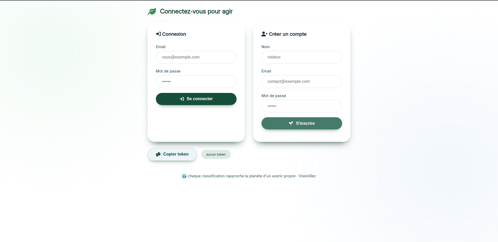
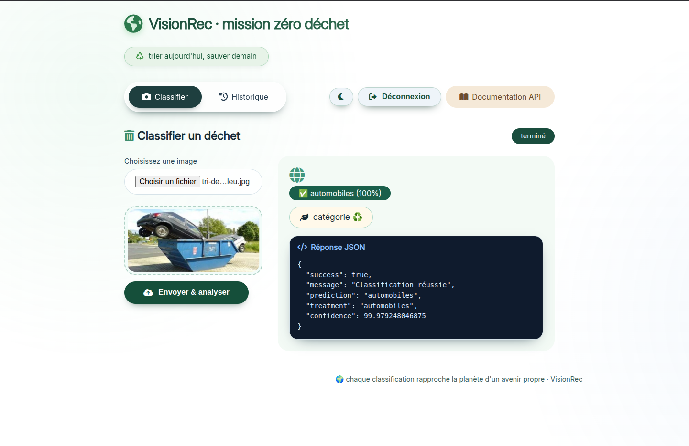
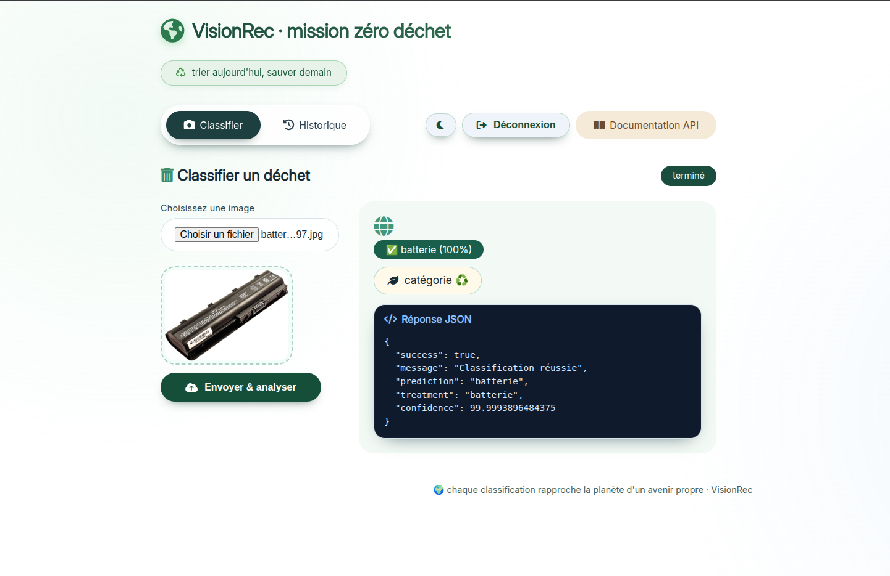
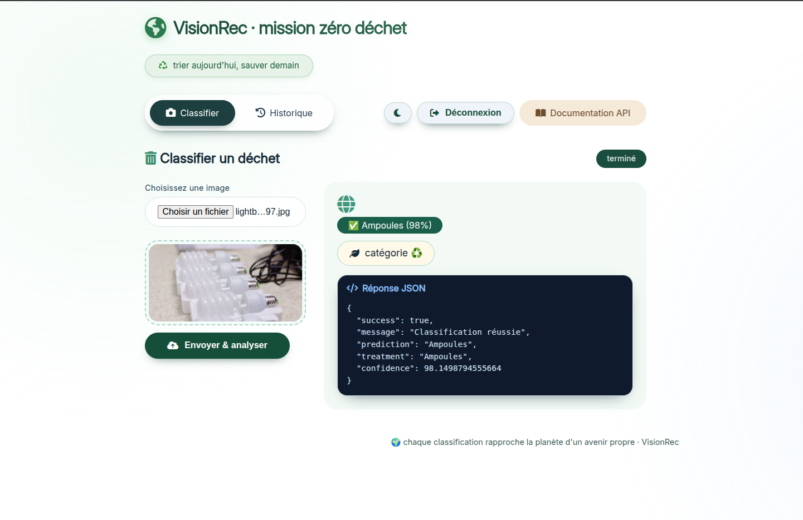
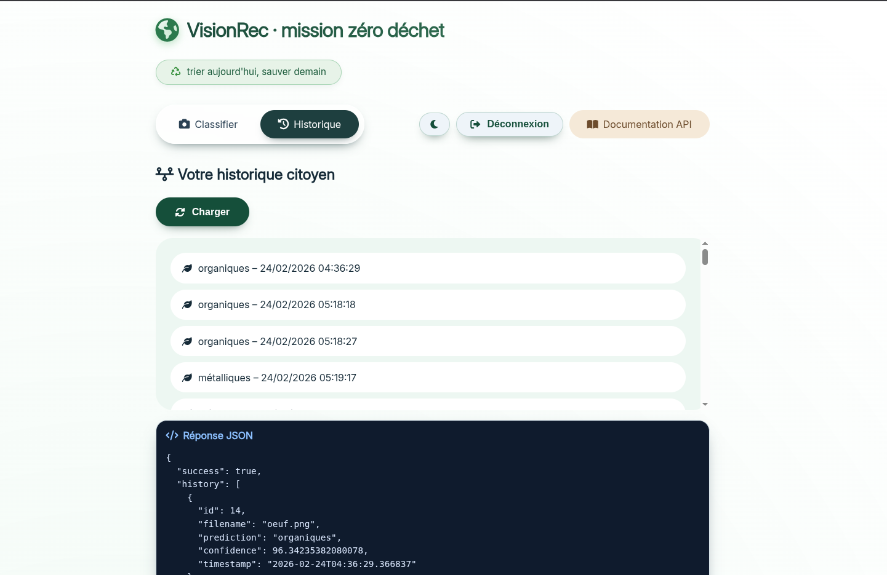
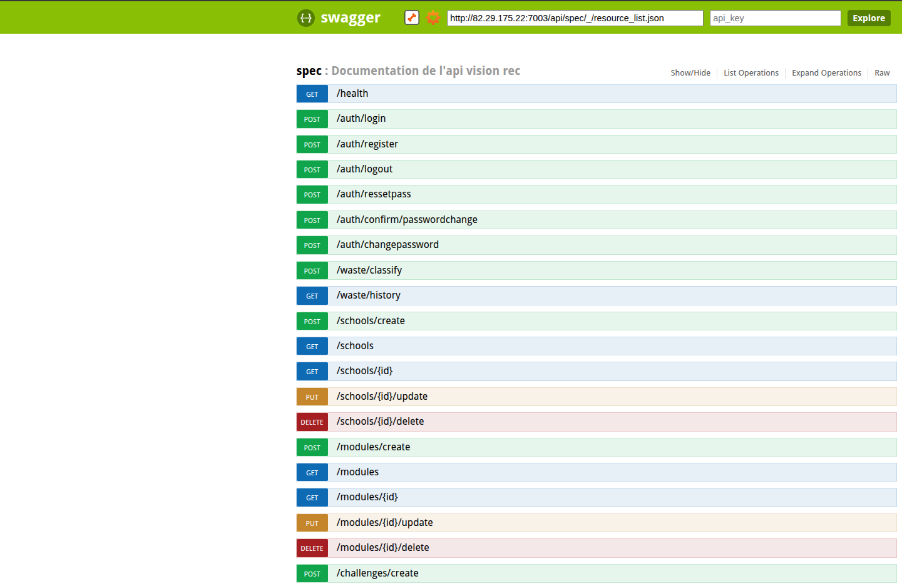
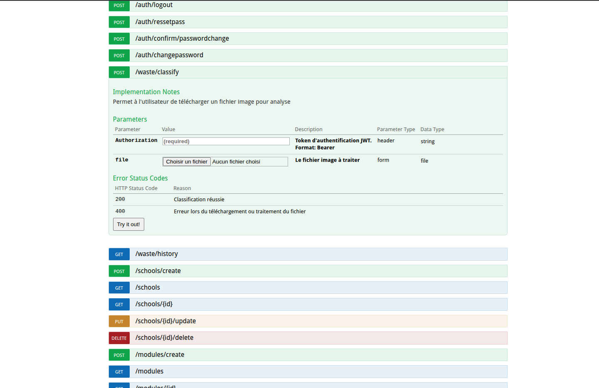

# VisionRec – Classification de déchets et analyse d’image IA

VisionRec est une application Flask qui combine :
- Authentification JWT et gestion des utilisateurs.
- Classification d’images de déchets via un modèle construit avec TensorFlow à l'issu du notebook d’exploration et d’entraînement.
- Historique des prédictions par utilisateur (PostgreSQL/SQLAlchemy + migrations Alembic). 
- Frontend statique de démonstration (upload, login, historique) servi depuis [app/static/templates/index.html](app/static/templates/index.html) et page visiteur rapide dans [app/static/demo/index.html](app/static/demo/index.html).

## Architecture
- Backend : Flask + Flask-RESTful + Swagger, JWT, CORS, SQLAlchemy, Flask-Migrate, Flask-Mail.
- Modèle CV : TensorFlow/Keras (CNN) chargé au démarrage depuis `models/waste_classifier_model.h5` avec labels `CLASS_NAMES` (électroniques, automobiles, batterie, verre, ampoules, plastiques, organiques, papier, métalliques) déclarés dans [app/routes/main/utils.py](app/routes/main/utils.py#L1-L40).
- Base de données : via `Config` (PostgreSQL attendu) et migrations Alembic dans [migrations/](migrations).
- Routes principales déclarées dans [app/__init__.py](app/__init__.py) :
	- Auth : `/auth/login`, `/auth/register`, `/auth/logout`, `/auth/ressetpass`, `/auth/confirm/passwordchange`, `/auth/changepassword`.
	- Classification protégée : `/waste/classify` (upload multipart, JWT), historique `/waste/history` (JWT).
	- Analyse IA (publique) : `/analyze` (fichier) et `/remote/analyze` (image par URL).
	- Santé : `/health` ; ping API : `/api`.
	- Frontend : `/` sert la page statique (demo UI) et `/static/...` pour les assets.
- Gestion d’erreurs custom : rend soit JSON (appels API) soit pages HTML brandées 400/401/404/500 ([app/errors/handlers.py](app/errors/handlers.py)).

## Frontend statique
- Page principale : [app/static/templates/index.html](app/static/templates/index.html) (login/register, upload, historique, affichage JSON, switch thème clair/sombre, déconnexion, copie token, toasts).
- Page démo rapide : [app/static/demo/index.html](app/static/demo/index.html) (tests rapides des endpoints avec fetch).
- Pages d’erreur stylées : [app/static/templates/400.html](app/static/templates/400.html), [401.html](app/static/templates/401.html), [404.html](app/static/templates/404.html), [500.html](app/static/templates/500.html).

## Modèle et entraînement (notebook)
Les étapes d’exploration, de préparation des données, d’entraînement et les visualisations (matrices de confusion, courbes d’apprentissage, exemples d’images) sont documentées dans le notebook [models/notebooks/presentation_notebook.ipynb](models/notebooks/presentation_notebook.ipynb). Réutilisez ce notebook pour rejouer ou ajuster le pipeline et exporter un nouveau `waste_classifier_model.h5`.

La dataset utilisée pour l’entraînement est disponible sur Kaggle :
https://www.kaggle.com/datasets/techsash/waste-classification-data

Elle contient des images de déchets classés en 9 catégories : électroniques, automobiles, batterie, verre, ampoules, plastiques, organiques, papier, métalliques. Le notebook inclut les étapes de prétraitement (redimensionnement, normalisation), la construction d’un CNN simple avec Keras, l’entraînement avec validation croisée et les visualisations des résultats.

## Installation & lancement
1) Créer un environnement Python 3.10+ et installer les dépendances :
	 - `pip install -r requirements.txt` (ou `requirements.all.txt` pour l’environnement complet).
2) Configurer les variables d’environnement (voir [config.py](config.py)) :
	 - `SQLALCHEMY_DATABASE_URI`, `JWT_SECRET_KEY`, `UPLOAD_FOLDER`, `ALLOWED_EXTENSIONS`, mail (SMTP), etc.
3) Lancer les migrations DB si nécessaire : `flask db upgrade` (ou `alembic upgrade head`).
4) Démarrer l’app : `python run.py` ou via Passenger avec [passenger_wsgi.py](passenger_wsgi.py).
5) Ouvrir http://localhost:5000/ pour le frontend, ou utiliser directement les endpoints REST.

## Endpoints REST (résumé)
- Auth : POST `/auth/login`, POST `/auth/register`, POST `/auth/logout`.
- Reset password : POST `/auth/ressetpass`, POST `/auth/confirm/passwordchange`, POST `/auth/changepassword`.
- Classification : POST `/waste/classify` (multipart `file`, JWT), GET `/waste/history` (JWT).
- Analyse IA : POST `/analyze` (multipart `image`, `prompt`, `max_tokens`, `temperature`), POST `/remote/analyze` (JSON `{image_url, prompt, ...}`).
- Santé : GET `/health`, ping API : GET `/api`.

## Composants techniques clés
- Sécurité : JWT longue durée (15 jours), CORS ouvert, validations côté auth (utils dans [app/routes/auth/utils.py](app/routes/auth/utils.py)).
- Stockage : SQLAlchemy models (ex. historique des prédictions `WasteHistory` dans [app/models/waste.py](app/models/waste.py)).
- Traitement image : prétraitement (OpenCV/PIL) et prédiction TensorFlow dans [app/routes/main/utils.py](app/routes/main/utils.py#L1-L80).
- Analyse avancée : processeur LLaVA dans [app/routes/main/llava_processor.py](app/routes/main/llava_processor.py) consommé par `/analyze` et `/remote/analyze`.

## Captures d’écran
- Authentification : 
- Upload & classification : 

- Historique : 
- Documentation Swagger : 
- Documentation Swagger : 

## Tests
- Tests disponibles dans [tests/](tests) (`test_models.py`, `test_routes.py`, `test_utils.py`). Exécuter : `pytest` depuis la racine du projet.

## Déploiement
- Passenger : via [passenger_wsgi.py](passenger_wsgi.py) (log redirigé vers `logs/app.log`).
- Pensez à :
	- Configurer la variable `FLASK_ENV`/`FLASK_DEBUG` selon l’environnement.
	- Servir `/static` derrière un reverse proxy (Nginx/Apache).
	- Sécuriser la clé JWT et les credentials mail/DB.

## Données & résultats
- Les figures (matrice de confusion, courbes d’entraînement, exemples prédits) sont intégrées dans le notebook [models/notebooks/presentation_notebook.ipynb](models/notebooks/presentation_notebook.ipynb). Exportez-les en HTML/PDF si besoin pour la documentation.
- Le rapport fonctionnel et descriptif se trouve dans [Rapport  du projet_Juste-Medis_Jeathusan.pdf](Rapport%20%20du%20projet_Juste-Medis_Jeathusan.pdf).

## Points d’attention
- Le dossier `app/static/uploads/` contient des exemples d’images (ex. `140131_132np_verre-brise_sn1250.avif`).
- Veillez à aligner `ALLOWED_EXTENSIONS` entre backend et frontend.
- Pour des perfs meilleures en prod : charger le modèle TensorFlow une seule fois (déjà fait) et activer un serveur WSGI (gunicorn/Passenger) derrière un proxy.
